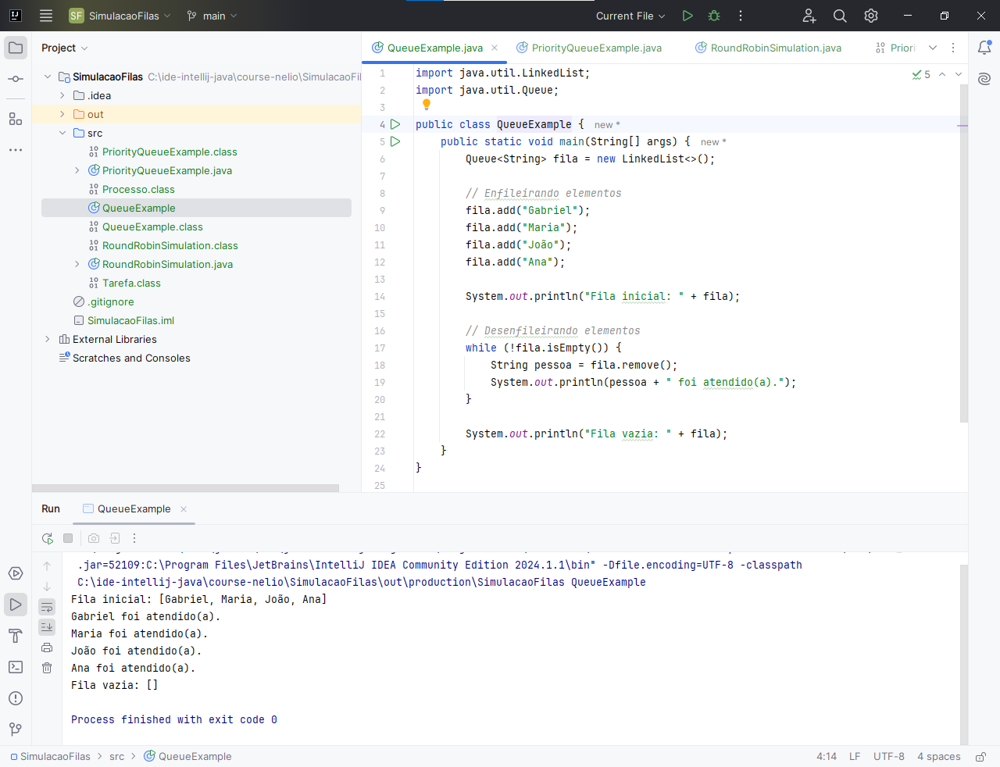
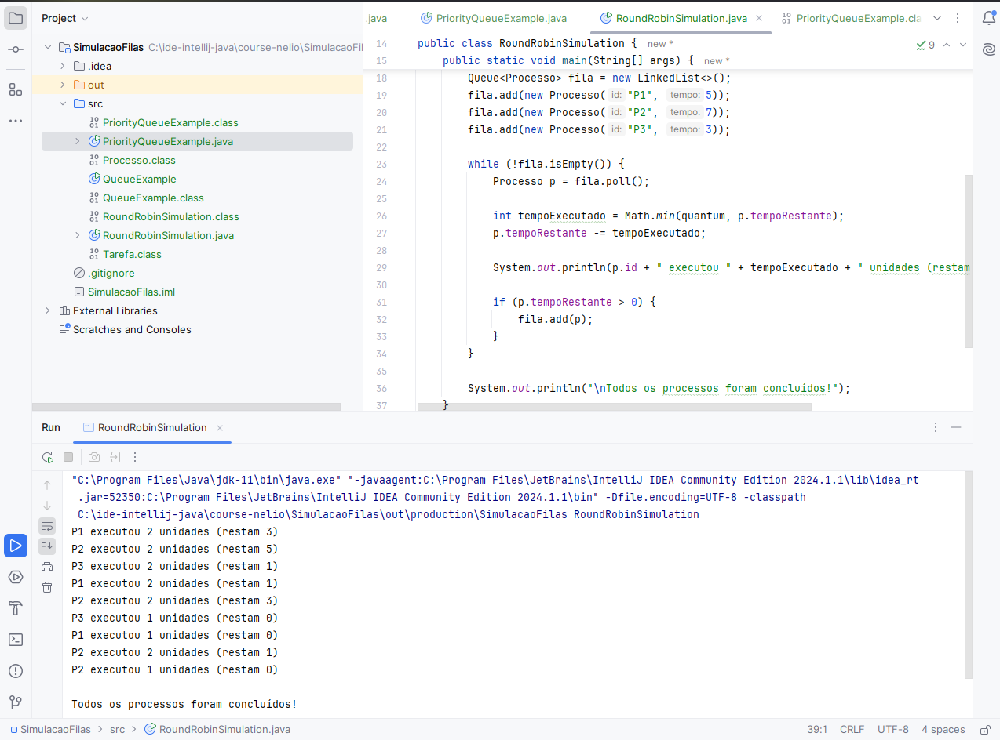
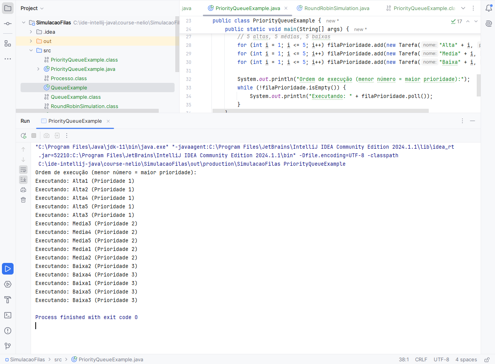

# Simulação de Filas e Escalonamento Round Robin em Java

Este projeto demonstra a aplicação prática das estruturas de dados **Queue (Fila)** e **Priority Queue (Fila de Prioridade)** em Java, culminando em uma simulação do algoritmo de escalonamento de processos **Round Robin**.

---

## 1. Queue (Fila FIFO)

A classe `QueueExample.java` ilustra o comportamento de uma fila tradicional, seguindo o princípio **FIFO (First-In, First-Out)**.

### Código de Exemplo:
```java
Queue<String> fila = new LinkedList<>();
fila.add("Gabriel");
fila.add("Maria");
fila.add("João");
fila.add("Ana");

while (!fila.isEmpty()) {
    String pessoa = fila.remove();
    System.out.println(pessoa + " foi atendido(a).");
}
Observações:

O método add() insere elementos no final da fila.

O método remove() remove e retorna elementos do início da fila.

2. Priority Queue (Fila de Prioridade)
A classe PriorityQueueExample.java mostra como o Java utiliza a interface Comparable para organizar elementos por prioridade, executando primeiro aqueles com o menor valor.

Código de Exemplo:
java
Copiar código
PriorityQueue<Tarefa> filaPrioridade = new PriorityQueue<>();

// 5 tarefas de alta prioridade, 5 de média e 5 de baixa
for (int i = 1; i <= 5; i++) filaPrioridade.add(new Tarefa("Alta" + i, 1));
for (int i = 1; i <= 5; i++) filaPrioridade.add(new Tarefa("Media" + i, 2));
for (int i = 1; i <= 5; i++) filaPrioridade.add(new Tarefa("Baixa" + i, 3));

while (!filaPrioridade.isEmpty()) {
    System.out.println("Executando: " + filaPrioridade.poll());
}
Observações:

Elementos com menor valor de prioridade são processados primeiro.

A fila garante a execução por prioridade, mesmo que os elementos sejam inseridos fora de ordem.

3. Simulação de Round Robin
A classe RoundRobinSimulation.java implementa um algoritmo de escalonamento Round Robin com quantum = 2.

Código de Exemplo:
java
Copiar código
Queue<Processo> fila = new LinkedList<>();
fila.add(new Processo("P1", 5));
fila.add(new Processo("P2", 7));
fila.add(new Processo("P3", 3));

int quantum = 2;

while (!fila.isEmpty()) {
    Processo p = fila.poll();
    int tempoExecutado = Math.min(quantum, p.tempoRestante);
    p.tempoRestante -= tempoExecutado;

    System.out.println(p.id + " executou " + tempoExecutado + " unidades (restam " + p.tempoRestante + ")");
    
    if (p.tempoRestante > 0) fila.add(p);
}
System.out.println("\nTodos os processos foram concluídos!");
Observações:

Cada processo executa por um tempo máximo igual ao quantum ou até ser concluído.

Processos que ainda têm tempo restante retornam ao final da fila.

O algoritmo garante uma execução justa e sequencial entre os processos.

4. Estrutura do Projeto
css
Copiar código
simulacao-filas-java/
│
├── src/
│   ├── QueueExample.java
│   ├── PriorityQueueExample.java
│   └── RoundRobinSimulation.java
│
├── prints/
│   ├── queueexample.png
│   ├── priorityqueueexample.png
│   └── roundrobinsimulation.png
│
└── README.md
5. Como Executar
Clone o repositório:

bash
Copiar código
git clone https://github.com/06gabrielsouza/simulacao-filas-java.git
Abra o Projeto:
Importe a pasta clonada em uma IDE Java como IntelliJ ou Eclipse.

Execute:
Execute a classe Java desejada: QueueExample, PriorityQueueExample ou RoundRobinSimulation.

## 🖼️ 6. Prints de Execução

### 📋 Fila (Queue FIFO)


### ⚡ Priority Queue


### 🔁 Round Robin


